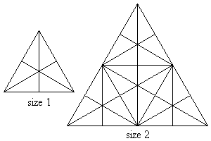

# Problem 113: Non-bouncy numbers

Working from left-to-right if no digit is exceeded by the digit to its
left it is called an increasing number; for example, 134468. Similarly
if no digit is exceeded by the digit to its right it is called a
decreasing number; for example, 66420. We shall call a positive integer
that is neither increasing nor decreasing a "bouncy" number; for
example, 155349. As n increases, the proportion of bouncy numbers below
n increases such that there are only 12951 numbers below one-million
that are not bouncy and only 277032 non-bouncy numbers below 1010. How
many numbers below a googol (10100) are not bouncy?