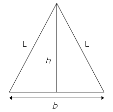

# Problem 138: Special isosceles triangles

Consider the isosceles triangle with base length, b = 16, and legs, L =
17. By using the Pythagorean theorem it can be seen that the height of
the triangle, h = √(172 − 82) = 15, which is one less than the base
length. With b = 272 and L = 305, we get h = 273, which is one more than
the base length, and this is the second smallest isosceles triangle with
the property that h = b ± 1. Find ∑ L for the twelve smallest isosceles
triangles for which h = b ± 1 and b, L are positive integers.