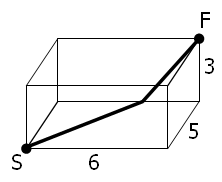

# Problem 586: Binary Quadratic Form

The number 209 can be expressed as \$a\^2 + 3ab + b\^2\$ in two distinct
ways: \$ \\qquad 209 = 8\^2 + 3\\cdot 8\\cdot 5 + 5\^2\$ \$ \\qquad 209
= 13\^2 + 3\\cdot13\\cdot 1 + 1\^2\$ Let \$f(n,r)\$ be the number of
integers \$k\$ not exceeding \$n\$ that can be expressed as \$k=a\^2 +
3ab + b\^2\$, with \$a\\gt b&gt;0\$ integers, in exactly \$r\$ different
ways. You are given that \$f(10\^5, 4) = 237\$ and \$f(10\^8, 6) =
59517\$. Find \$f(10\^{15}, 40)\$.